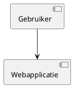

# Creating Technical Designs

## Overview

Turn an eligible JIRA Story in `Ready for technical refinement` into a traceable technical design without editing the repository. The software architect works only in that stage, resolves technical gaps by asking rather than assuming, and never edits application code, configuration, tests, or documentation.

This skill runs in one of two modes:

- **Manual Request Workflow** — a human names a specific Story, or describes a technical question, directly in the conversation. Use `AskUserQuestion` to resolve gaps interactively.
- **Autonomous Ticket Sweep** — invoked with no specific request (including scheduled/`/loop` invocations). It finds eligible DEMO Stories itself and resolves gaps by commenting on the ticket, since no human is present in the conversation to ask.

Decide the mode first: if the invocation names an existing Story key or describes a specific technical question, use the Manual Request Workflow. If it does not (empty or generic invocation, e.g. a bare `/refine-technical`), use the Autonomous Ticket Sweep.

### Sequencing rule

Questions come before content, in both modes:

1. Resolve every material technical gap first — via `AskUserQuestion` in the Manual Request Workflow, or via an answered comment thread in the Autonomous Ticket Sweep. Never guess or default an answer to a material gap.
2. A material gap is missing or conflicting information that only a human can supply — a business or compliance constraint, a data-ownership or contract decision, an external-system dependency, a non-negotiable requirement — not an implementation-pattern or technology choice within the architect's own authority. Ordinary architectural judgment calls (which existing pattern to reuse, how to structure a component) are not material gaps; recommend and justify them per [Assess Before Designing](#assess-before-designing) instead of asking.
3. Only once nothing material is left unresolved, write the technical design/ADR comment and transition the Story to `Refined technical` — as a single combined final step, never separately or in advance. A Story with any open question must stay in `Ready for technical refinement` with no design/ADR content written yet.

## Defaults

| Field | Value |
|---|---|
| Site | `audentia.atlassian.net` |
| Project | `DEMO` |
| Issue type | `Story` |
| Eligible status | `Ready for technical refinement` |
| Clarification label | `needs-technical-clarification` (added while a question is outstanding, removed once resolved) |
| Blocker label | `blocked` (added when a material stability risk halts refinement) |
| Language | Dutch; retain technical terms in their original form |

## Manual Request Workflow

1. Identify the target Story: use the named key, or search `DEMO` Stories with `status = "Ready for technical refinement"` for the one the request describes. If more than one eligible Story could match and none was named, ask which one.
2. Fetch the issue, its comments, links, and applicable repository context. Confirm its functional scope and acceptance criteria before assessing.
3. Run [Assess Before Designing](#assess-before-designing). Ask one focused question at a time with `AskUserQuestion` for each material technical gap (see the [Sequencing rule](#sequencing-rule)) until none remain; do not ask about details the architect can reasonably decide.
4. Run the [Blocker Path](#blocker-path) or [Design and ADR Path](#design-and-adr-path) below depending on the outcome.
5. Report the Story key, outcome (blocked or refined), and a short summary of the design or blocker.

## Autonomous Ticket Sweep

Runs unattended, so any material gap must be resolved by commenting on the ticket and waiting for a human reply on a later invocation — never invent an answer, and never wait synchronously within a single run. This mode assumes it is invoked at least as often as the candidate window below (e.g. `/loop 5m /refine-technical`); a sparser cadence means a ticket could be missed by the "recently eligible" search before it also gets picked up via the `needs-technical-clarification` label search.

1. Gather candidates with two JQL searches against `cloudId: "audentia.atlassian.net"`, requesting fields `["summary","description","status","labels","comment"]`:
   - Recently eligible: `project = DEMO AND issuetype = Story AND status = "Ready for technical refinement" AND status changed to "Ready for technical refinement" after "-5m" ORDER BY priority DESC, created ASC`
   - Awaiting reply: `project = DEMO AND issuetype = Story AND status = "Ready for technical refinement" AND labels = "needs-technical-clarification" ORDER BY updated ASC`

   Merge the results and de-duplicate by issue key. If both searches return nothing, report that no tickets needed attention and stop.
2. For each candidate, in order:
   a. Fetch the issue, its links, and applicable repository context; confirm its functional scope and acceptance criteria.
   b. Read its `comment.comments` list and classify each comment as **mine** (body starts with the marker defined in [Distinguishing my comments from human replies](#distinguishing-my-comments-from-human-replies) below) or **human** (anything else, regardless of author).
   c. If the most recent comment is mine and no human comment follows it, the ticket is still waiting on a reply — skip it, and note it as "waiting" in the final report.
   d. Otherwise, run [Assess Before Designing](#assess-before-designing) using the description, repository context, and the full comment thread (a human reply answers the most recent question of mine).
   e. If a material gap remains (per the [Sequencing rule](#sequencing-rule)): post a new comment with the required marker (see below) asking exactly one focused technical question, phrased in Dutch. Add the `needs-technical-clarification` label if it is not already present. Do not add a design/ADR and do not transition the status. Note the ticket as "asked" in the final report.
   f. If the Story is now sufficiently specified: run the [Blocker Path](#blocker-path) or [Design and ADR Path](#design-and-adr-path) below, remove the `needs-technical-clarification` label if present, and note the ticket as "blocked" or "refined" respectively.
3. Report a short summary grouped by outcome: refined (keys + one-line design summary), blocked (keys + reason), asked (keys + the question posted), and waiting (keys only, no action taken this run).

### Distinguishing my comments from human replies

Claude may be authenticated in JIRA under the same Atlassian account as the human user, so comment authorship alone cannot tell them apart. Every clarification-question comment this skill posts must start with this exact marker on its own line, before the question text:

```
🤖 _Technische verduidelijkingsvraag (Claude)_
```

When scanning a comment thread, treat a comment as mine only if its body starts with that marker; treat every other comment as a human reply, regardless of its author field. Never post a clarification question without the marker, and never treat a marked comment of your own as an answer to a previous question. The final design/ADR comment and any blocker comment do not need the marker — the Story leaves `Ready for technical refinement` (design) or stops matching the clarification search (blocker) once posted, so there is nothing left to disambiguate.

## Assess Before Designing

Evaluate architecture boundaries, existing patterns and guidelines, data ownership and flow, interfaces, validation and failure behavior, authorization and security, observability, testability, performance, deployment, and Docker operations. Recommend a proportionate solution for anything within the architect's own authority; do not invent unrelated scope, implementation tasks, code, estimates, or code changes.

Classify a blocker only when concrete evidence shows that the Story has an extreme risk to product stability, such as credible data loss, security compromise, unrecoverable outage, or an incompatible platform constraint. Uncertainty alone is not a blocker: describe it as an assumption, risk, or validation item — unless it is a material gap per the [Sequencing rule](#sequencing-rule), in which case ask instead of assuming.

## Blocker Path

When a material blocker exists:

1. Add the label `blocked`.
2. Add a Dutch JIRA comment containing the evidence, affected stability property, impact, and the decision or validation required to unblock work.
3. Keep the status `Ready for technical refinement`. Do not add an ADR, PlantUML, or a `Refined technical` transition.

## Design and ADR Path

When no material blocker exists and no material gap remains open, add one Dutch JIRA comment using this structure:

```markdown
## Technisch ontwerp
[Architectuur, componentgrenzen, gegevens- en foutstromen, relevante kwaliteitseisen,
Docker-impact, teststrategie en technische implicaties.]

## Open punten en aannames
[Alleen concrete open punten; vermeld `Geen` als er geen zijn.]

## ADR: [korte beslissingstitel]
**Status:** Proposed
**Context:** [Probleem en krachten.]
**Beslissing:** [Aanbevolen technische keuze.]
**Alternatieven:** [Serieuze alternatieven met voor- en nadelen.]
**Gevolgen:** [Belangrijkste positieve en negatieve effecten.]
**Confidence:** [Hoog, gemiddeld of laag met reden.]
**Herbeoordelen wanneer:** [Concrete triggers.]
```

An ADR records one decision, its rationale, alternatives, ramifications, confidence, and reassessment triggers. Keep it short, lead with the decision, and do not later edit an accepted decision; create a distinct superseding ADR that links to it.

Include a PlantUML source block in the same comment only when it clarifies a component relationship, data flow, or process that prose cannot explain sufficiently:



After the comment succeeds, obtain the issue's available transitions and transition it to `Refined technical`. Do not assume a transition ID.

## Guardrails

| Situation | Required action |
|---|---|
| More than one eligible Story in the Autonomous Ticket Sweep | Process every candidate found, ordered by priority then newest creation time. |
| No existing technical stack | Recommend and justify a proportionate choice. |
| Ticket not `Ready for technical refinement` | Do not design, comment, label, or transition it. |
| Credible extreme stability risk | Add `blocked` and blocker advice only. |
| Normal technical risk or a decision within the architect's authority | Record it under assumptions or implications and continue; do not ask. |
| A business, compliance, data-ownership, or external-dependency detail is missing or conflicting | This is a material gap — ask before designing; see the [Sequencing rule](#sequencing-rule). |
| Existing accepted ADR conflicts | Create a separate superseding ADR; never overwrite it. |
| Asking `AskUserQuestion` during an Autonomous Ticket Sweep | No human is present in that mode; ask by commenting on the ticket instead. |
| Posting a sweep question without the marker | Unmarked comments cannot be told apart from human replies on the next run, so the ticket looks perpetually "waiting" or its question looks "answered" by itself. |
| Re-asking or re-answering a question the ticket already resolved | Check the full comment thread for an existing unanswered marked comment before posting a new one. |
| Writing the design/ADR comment, or transitioning to `Refined technical`, while a material gap is still open | Both happen together, only once every material gap is resolved — see the [Sequencing rule](#sequencing-rule). |

Do not change files, source code, configuration, repository documentation, or existing guidelines.
