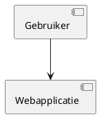

# Creating Technical Designs

Create a traceable technical design for one eligible JIRA Story without editing the repository. Preserve existing conventions and make a concise, evidence-based recommendation when technical details are absent.

## Select the Story

1. Search only `DEMO` Stories with `status = "Ready for development"`, ordered by `priority DESC, created DESC`. Select the first result. Do not process an issue from any other status.
2. If no eligible Story exists, report that no work was performed. Do not change JIRA.
3. Fetch the selected issue, its comments, links, and applicable repository context. Confirm its functional scope and acceptance criteria before designing.

## Assess Before Designing

Evaluate architecture boundaries, existing patterns and guidelines, data ownership and flow, interfaces, validation and failure behavior, authorization and security, observability, testability, performance, deployment, and Docker operations. Recommend a proportionate solution; do not invent unrelated scope, implementation tasks, code, estimates, or code changes.

Classify a blocker only when concrete evidence shows that the Story has an extreme risk to product stability, such as credible data loss, security compromise, unrecoverable outage, or an incompatible platform constraint. Uncertainty alone is not a blocker: describe it as an assumption, risk, or validation item.

## Blocker Path

When a material blocker exists:

1. Add the label `blocked`.
2. Add a Dutch JIRA comment containing the evidence, affected stability property, impact, and the decision or validation required to unblock work.
3. Keep the status `Ready for development`. Do not add an ADR, PlantUML, or a `Refined` transition.

## Design and ADR Path

When no material blocker exists, add one Dutch JIRA comment using this structure:

```markdown
## Technisch ontwerp
[Architectuur, componentgrenzen, gegevens- en foutstromen, relevante kwaliteitseisen,
Docker-impact, teststrategie en technische implicaties.]

## Open punten en aannames
[Alleen concrete open punten; vermeld `Geen` als er geen zijn.]

## ADR: [korte beslissingstitel]
**Status:** Proposed
**Context:** [Probleem en krachten.]
**Beslissing:** [Aanbevolen technische keuze.]
**Alternatieven:** [Serieuze alternatieven met voor- en nadelen.]
**Gevolgen:** [Belangrijkste positieve en negatieve effecten.]
**Confidence:** [Hoog, gemiddeld of laag met reden.]
**Herbeoordelen wanneer:** [Concrete triggers.]
```

An ADR records one decision, its rationale, alternatives, ramifications, confidence, and reassessment triggers. Keep it short, lead with the decision, and do not later edit an accepted decision; create a distinct superseding ADR that links to it.

Include a PlantUML source block in the same comment only when it clarifies a component relationship, data flow, or process that prose cannot explain sufficiently:



After the comment succeeds, obtain the issue's available transitions and transition it to `Refined`. Do not assume a transition ID.

## Guardrails

| Situation | Required action |
|---|---|
| More than one eligible Story | Use JIRA priority, then newest creation time. |
| No existing technical stack | Recommend and justify a proportionate choice. |
| Ticket not `Ready for development` | Do not design, comment, label, or transition it. |
| Credible extreme stability risk | Add `blocked` and blocker advice only. |
| Normal technical risk or unknown | Record it under assumptions or implications and continue. |
| Existing accepted ADR conflicts | Create a separate superseding ADR; never overwrite it. |

Do not change files, source code, configuration, repository documentation, or existing guidelines.
